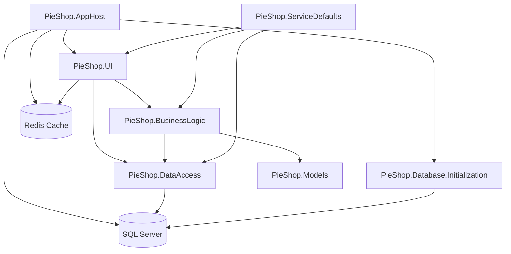

# Solution Overview

## Goal and Purpose

The DotnetAspire5-PieShop solution is a cloud-ready, modular .NET Aspire application for an online pie shop. It demonstrates best practices in service orchestration, distributed caching, and database management, providing features such as user authentication, product catalog, shopping cart, and order processing.

## Architecture

The solution consists of several projects:

- **PieShop.AppHost**: Orchestrates all services, manages startup and dependencies.
- **PieShop.UI**: ASP.NET Core MVC frontend for user interaction, authentication, and product display.
- **PieShop.BusinessLogic**: Implements business rules and service interfaces for core features.
- **PieShop.DataAccess**: Handles data persistence, repositories, and migrations using Entity Framework.
- **PieShop.Database.Initialization**: Seeds and initializes the database during development.
- **PieShop.Models**: Domain models for pies, categories, orders, users, and shopping carts.
- **PieShop.ServiceDefaults**: Shared configuration and service setup utilities.
- **SQL Server**: Relational database for persistent storage.
- **Redis Cache**: Distributed cache for session and output caching.

### Service Relationships

- **AppHost** orchestrates all services, ensuring correct startup order.
- **UI** depends on **BusinessLogic** and **DataAccess** for operations.
- **BusinessLogic** uses **DataAccess** and **Models** for domain logic.
- **DataAccess** interacts with SQL Server.
- **UI** and **AppHost** configure Redis for distributed caching.
- **Database Initialization** is performed by a dedicated worker, started by AppHost.

## Architecture Diagram (Mermaid)

## Main Components

- **PieShop.AppHost**: Orchestrates all services and manages configuration.
- **PieShop.UI**: User-facing web application for authentication, product browsing, shopping cart, and orders.
- **PieShop.BusinessLogic**: Business rules and service interfaces.
- **PieShop.DataAccess**: Data access via repositories and Entity Framework.
- **PieShop.Database.Initialization**: Database seeding and initialization.
- **PieShop.Models**: Domain models.
- **PieShop.ServiceDefaults**: Shared configuration utilities.
- **SQL Server**: Persistent storage.
- **Redis Cache**: Distributed caching.

## Features

- User authentication and role-based authorization.
- Product catalog and category management.
- Shopping cart and order processing.
- Distributed caching for performance.
- Database initialization and migration support.
- Modular architecture leveraging .NET Aspire.

## Intended Use

This solution is for developers and organizations seeking a reference architecture for cloud-native .NET applications using Aspire. It demonstrates service orchestration, distributed caching, and database management in a multi-project solution.

---

*Documentation generated by GitHub Copilot Agent on 2025-07-14-15_32_10.*
